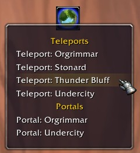

Rift is a 1.12 addon for mages. It adds a freely-movable button to your UI that can be used to access a list of all your teleportation and portal spells.

Rift is open-ended and future-proof (it crawls your spell book for all spells starting with "Teleport: " and "Portal: ").

Rift is as light-weight as possible. It checks your class after loading into the game and goes dormant if you're not playing a mage. Even for mages it only crawls your spell book once you click the button. Rift does not save data in WTF either. The position of the button is handled and saved entirely by the Blizzard UI (drag with LMB while holding down CTRL to move the button).